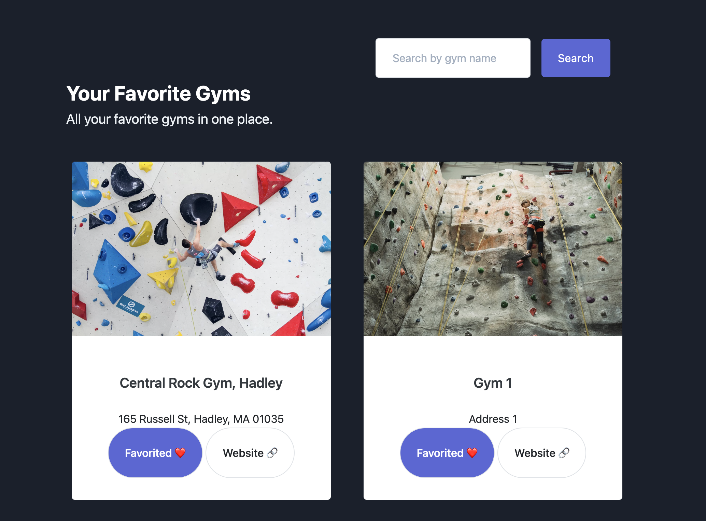
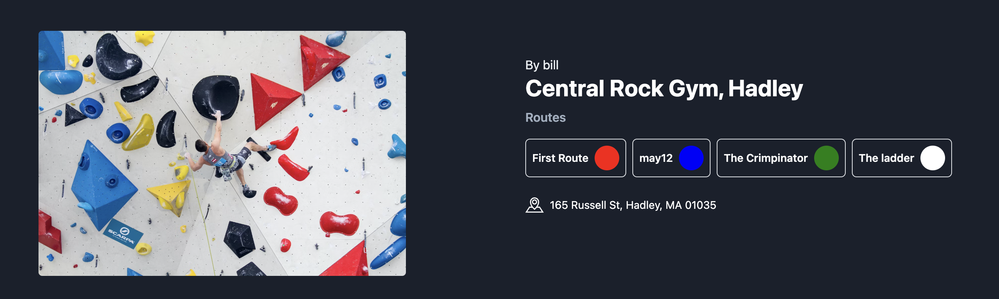
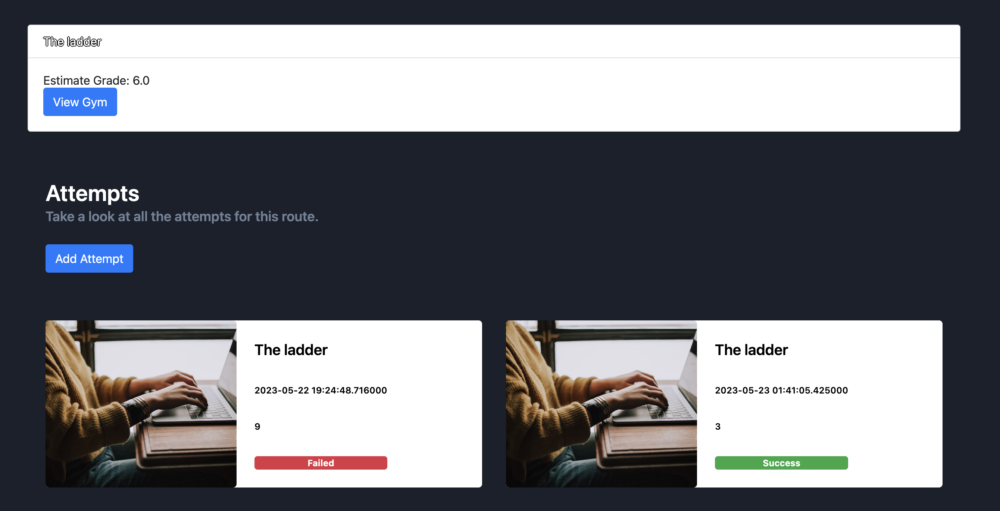
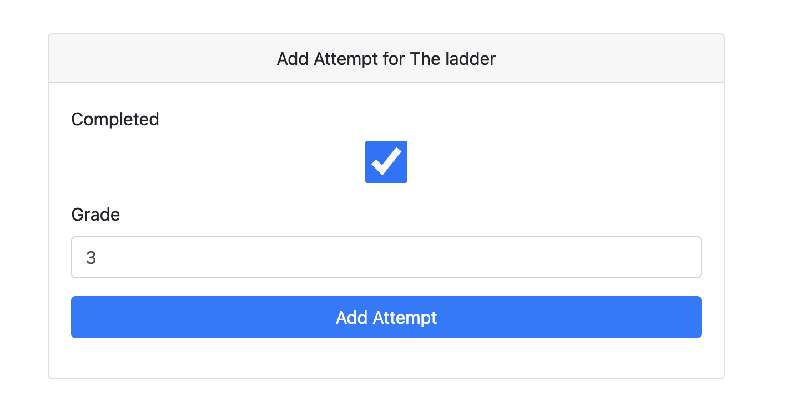
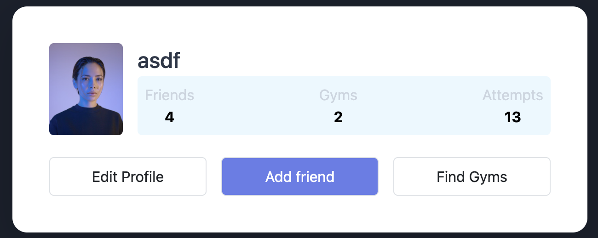

# RouteRater

## Setup

Clone the repository

`git clone https://github.com/billray0259/cs520_final_project.git`

Enter the repository directory

`cd cs520_final_project`

Create a virtual environment

`python3 -m venv .env`

Activate the environment

`source .env/bin/activate`

Install the requirements

`pip install -r requirements.txt`

Enter into the `src` directory and run `app.py`

`cd src && python app.py`

This web app is designed to improve the accuracy of difficulty ratings for indoor climbing routes. Currently, the difficulty ratings are set by the route setters and can be arbitrary, leading to inconsistent and inaccurate ratings.

The proposed solution is a web app that utilizes QR codes placed at the bottom of each route. Climbers can scan the QR code with their mobile device and be directed to a page where they can rate the route's difficulty and indicate if they were able to complete the route and how many attempts it took. The app will keep track of each climber's ratings and create a profile that reflects their climbing ability. This information will allow the app to provide a more accurate and data-driven difficulty rating for each route.

In addition to improving the accuracy of difficulty ratings, the app will enable climbers to track their skill progress over time and view their personal growth.

To use the app, simply scan the QR code at the bottom of the climbing route and rate the difficulty. Your profile will keep track of your progress and the app will update the route's difficulty rating based on the collective ratings of all climbers.

## Directions for using RouteRater

In order to create a RouteRater account, click "Sign Up" on the home page and enter in your email, username, and password.

### For Climbers

On the "Gyms" page, there are many different gyms that climbers can add as their favorites. To add a certain gym as a favorite, click the "Add to favorites" button associated with the gym. All gyms that a climber has added as favorites will appear at the top of the "Gyms" page. To unfavorite a gym, click the "Favorited" button associated with the gym. In addition, each gym listed in the "Gyms" page has a link to its website. A climber can also search for gyms by utilizing the search bar on the top of the page, with the search results listing all gyms that have not yet been added as one of the climber's favorites.

A list of each gym's routes can be accessed by clicking the name of the gym on the "Gyms" page and are color-coded to differentiate them from each other.

Each of these routes has one or more previous climber attempts on the route, with each attempt specifying the time the attempt was added, whether the climber making that attempt succeeded or failed climbing the route, and a difficulty score consisting of integers on a scale of 1 to 10. The difficulty scores of all of a route's current attempts are averaged to compute the route's overall estimate grade.

Climbers can add their own attempt on a certain route by clicking "Add Attempt" on the route's page. The climber will specify whether they succeeded climbing the route by filling in the "completed" check box only if their attempt was successful as well as a difficulty score consisting of an integer from 1 to 10. Once this attempt is added, it will be listed alongside the route's previous attempts, and the estimate score will be updated based on the score provided in the new attempt.

The "Profile" page for each user will list the number of friends they added, the number of gyms they favorited, and the total number of attempts they added for all routes from all gyms. In addition, all of the user's attempts across all routes will be listed on this page. Users can add friends by clicking on the "Add friend" button and utilizing the given search bar to search for a user to add as a friend.

### For Gym Owners

Owners of certain gyms also have RouteRater accounts but, unlike regular users (Climbers), are able to add new routes to the gym(s) that they own. In order to add a new route, owners need to specify the route's name, the color it will be assigned, and the ID of its gym. After the new route is added, a QR code that links to the route's page will be generated.

