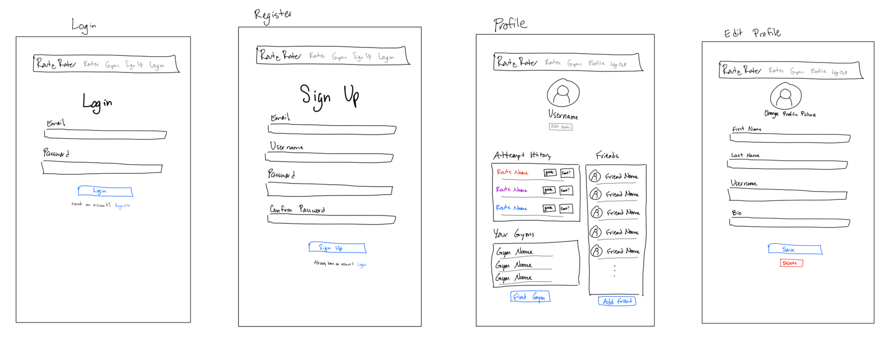
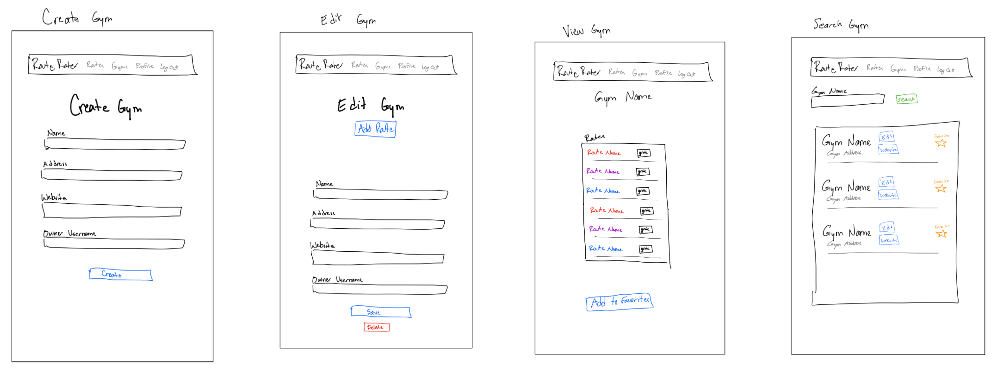
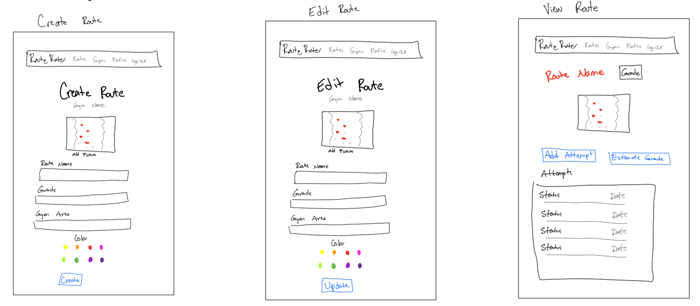
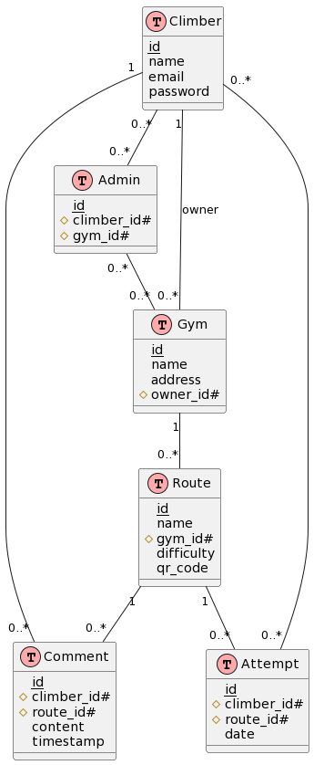

# Route Rater Climbing App
William Ray (gh: billray0259), Josh Viktrov (gh: JAV27), Andrew Xie (gh: ax1313), Roshan Praveen Shetty (gh: RoshanPShetty)

## [Presentation Video] # TODO
## [GitHub Repository](https://github.com/billray0259/cs520_final_project)

# Software Requirements Specifications (SRS)
## Overview
This web app is designed to improve the accuracy of difficulty ratings for indoor climbing routes. Currently, the difficulty ratings are set by the route setters and can be arbitrary, leading to inconsistent and inaccurate ratings.

The proposed solution is a web app that utilizes QR codes placed at the bottom of each route. Climbers can scan the QR code with their mobile device and be directed to a page where they can rate the route's difficulty and indicate if they were able to complete the route and how many attempts it took. The app will keep track of each climber's ratings and create a profile that reflects their climbing ability. This information will allow the app to provide a more accurate and data-driven difficulty rating for each route.

In addition to improving the accuracy of difficulty ratings, the app will enable climbers to track their skill progress over time and view their personal growth.

To use the app, simply scan the QR code at the bottom of the climbing route and rate the difficulty. Your profile will keep track of your progress and the app will update the route's difficulty rating based on the collective ratings of all climbers.

## Stakeholders
1. Climbers: Use the app to rate routes, track progress, and view personal growth. They are directly affected by the app's functionality and accuracy.
2. Route Setters: Use app data to improve route ratings and understand climbers' preferences. They are responsible for setting up climbing routes.
3. Gym Staff and Management: Monitor route usage and gather feedback for facility improvements. They maintain climbing facilities and interact with climbers.
4. Development Team: Create, maintain, and improve the RouteRater app. They are responsible for the app's development.
5. Quality Assurance Team: Test and validate the app's functionality and quality. They ensure the app meets specified requirements and quality standards.
6. Suppliers and Partners: Provide services contributing to the software project, such as hosting or data storage.
7. Regulators: Ensure compliance with standards, regulations, or guidelines, including data privacy regulations like GDPR.
8. Competitors: Apps like Kaya and Pebble that may be influenced by the RouteRater app's performance and popularity. They offer similar route rating or progress tracking apps.

## Features 
1. User Interface: User-friendly interface for rating routes, and tracking progress.
2. User Experience: Smooth and intuitive navigation, error handling, and responsive feedback to user actions.
3. Functionality: Registration, login, gym search, route rating, and profile viewing for climbers.
4. Performance: Efficient processing and data storage using Flask and MongoDB for quick response times and reliable performance.
5. Scalability: Accommodate increasing numbers of users and routes while maintaining functionality.
6. Security: Secure password hashing and CSRF tokens for user data protection and authentication.
7. Customizability: Customize profiles by adding or removing favorite gyms and tracking route progress.
8. Integration: QR codes for easy access and potential integration with other services or platforms.
9. Portability: Accessible on various devices and platforms through a web browser.
10. Maintainability: Organized and modular source code for easier updates and modifications.
11. Documentation: Detailed documentation for developers to understand and maintain the codebase.

## Functional Requirements:
1. User authentication, registration, and login with validation for email, username, and password.
2. Gym creation, management, and route management within gyms by authorized users.
3. QR code generation and scanning for unique codes for each route.
4. Climber rating, route completion, and difficulty rating calculation based on collective ratings.
5. Comment and attempt logging for climber experiences on routes.
6. Search functionality for gyms and climbers with relevant results.
7. Data management for gyms, routes, climbers, and ratings with correct updates for new information.

## Non-Functional Requirements:
1. Performance: Quick load times and minimal latency, especially when interacting with the database.
2. Usability: Intuitive and easy-to-navigate interface for users to access information and features.
3. Security: Access controls to protect against unauthorized access or data breaches.
4. Scalability: Accommodate growth in users and data without significant impact on performance or user experience.
5. Reliability: Consistent and accurate operation with minimal downtime or errors.
6. Maintainability: Well-organized and documented codebase, easy for developers to update, troubleshoot, and improve.
7. Cross-platform compatibility: Consistent operation across different web browsers and operating systems.

# Design

## Architecture
The app follows a model, view, controller, architecture with frontend, backend, and database components. Frontend displays the UI and communicates with the backend through API calls using HTML, CSS, JavaScript, Bootstrap, and Jinja2 templates. Backend processes requests and interacts with the MongoDB database using Python, Flask, and Flask-Login. Data is returned to the frontend, updating the UI.

## Tech Stack
* Frontend: HTML, CSS, JavaScript, [tailwindcss](https://tailwindcss.com/), [Bootstrap](https://getbootstrap.com/), [Jinja2](https://jinja.palletsprojects.com/en/3.1.x/)
* Backend: Python, [Flask](https://flask.palletsprojects.com/en/2.2.x/), [Flask-Login](https://flask-login.readthedocs.io/en/latest/)
* Database: [MongoDB](https://www.mongodb.com/), [PyMongo](https://pymongo.readthedocs.io/en/stable/)
* Other libraries: YAML, QR code generation library

# Tech Stack Justification
Python, Flask, and Flask-Login were chosen for their simplicity, readability, and ease of use. MongoDB and PyMongo provide flexibility and performance in handling diverse data types. Bootstrap and Jinja2 ensure a responsive and visually appealing user interface. Since we don't anticipate the app being heavily dynamic we decided no frontend framework is necessary and vanilla javascript will satisfy our requirements while keeping the app lightweight. YAML manages configuration settings, and QR code generation enables core app functionality. 

## Evaluation Plan

### Evaluating Functional Requirements

<!-- Josh: We might want to add where and how we plan to automate these things. I think have fewer quality automated tests might be better than many non-automated tests.  -->
1. User authentication and registration:
* Test that users can successfully register with valid email, username, and password.
* Test that users cannot register with invalid or duplicate email and username.
* Test that users can log in with the correct email and password.
* Test that users cannot log in with incorrect email or password.

2. Gym creation and management:
* Test that gym owners can create a gym with valid information.
* Test that gym owners can edit gym details and manage routes within their gym.
* Test that unauthorized users cannot create, edit or manage gyms.

3. Route creation and management:
* Test that admins and gym owners can add, edit, and remove routes within a gym.
* Test that unauthorized users cannot create or manage routes.

4. QR code generation and scanning:
* Test that unique QR codes are generated for each route.
* Test that scanning the QR code directs the user to the correct route page.

5. Climber rating and route completion:
* Test that climbers can rate a route's difficulty and indicate their completion status.
* Test that unauthorized users cannot rate routes or indicate completion status.

6. Difficulty rating calculation:
* Test that the application correctly calculates a route's difficulty rating based on the collective ratings of all climbers.
* Test that the difficulty rating updates as new ratings are submitted.

7. Climber progress tracking:
* Test that climbers can view their personal climbing progress and skill growth over time.
* Test that unauthorized users cannot view other climbers' progress.

8. Comment and attempt logging:
* Test that climbers can log their attempts on a route and leave comments about their experience.
* Test that unauthorized users cannot log attempts or leave comments.

9. Search functionality:
* Test that users can search for gyms, routes, and other climbers.
* Test that the search results are accurate and relevant.

10. Data management:
* Test that the app can store, retrieve, and manage data related to gyms, routes, climbers, and ratings.
* Test that data is correctly updated when new information is added, edited, or removed.

### Evaluating Non-Functional Requirements
1. Performance Testing: Measure app's load times, response times, and resource usage.
3. Usability Testing: Evaluate UI, navigation, and user experience with target audience representatives.
4. Load Testing: Simulate app behavior under heavy traffic and high data volumes.
5. Alpha/Beta Testing: Identify issues and gather feedback with internal and external users before the final release.

<!-- We should probably expand on alpha/beta testing... wasn't sure what to do for those -->
<!-- Josh: I'm not sure setting up Alpha/Beta testing is going to be feasible in the time frame for the project. We can also just focus on usability surveys (that seems a lot easier) -->

### References
AllTrails: Trail Guides & Maps for hiking, camping, and running. AllTrails.com. (2023). Retrieved April 19, 2023, from https://www.alltrails.com/ 
The climber's app. KAYA. (2023). Retrieved April 19, 2023, from https://kayaclimb.com/ 
Pebble climbing. Pebble Climbing. (2023). Retrieved April 19, 2023, from https://www.pebbleclimbing.com/ 
Running, Cycling & Hiking App - Train, track & share. Strava. (2023). Retrieved April 19, 2023, from https://www.strava.com/ 

# Appendix

